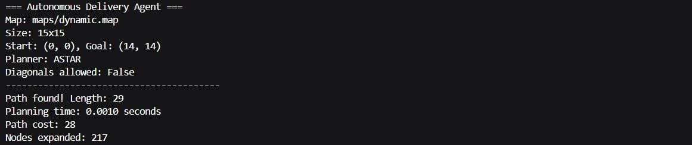
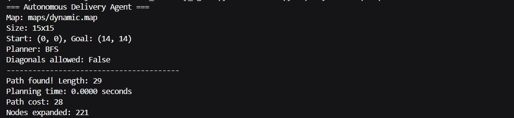
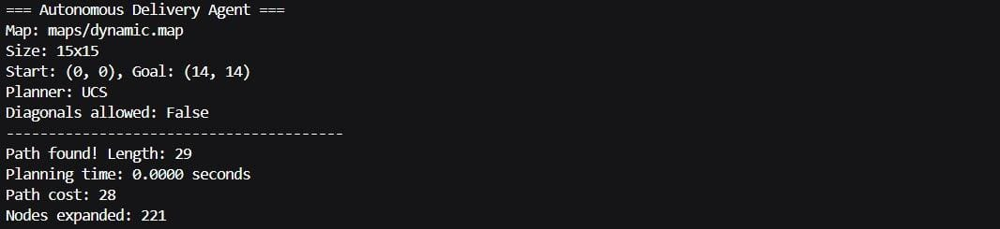
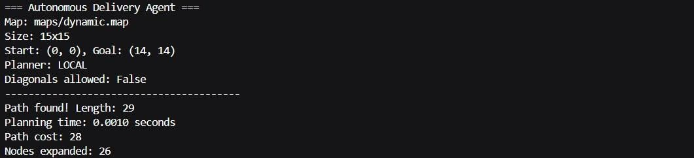
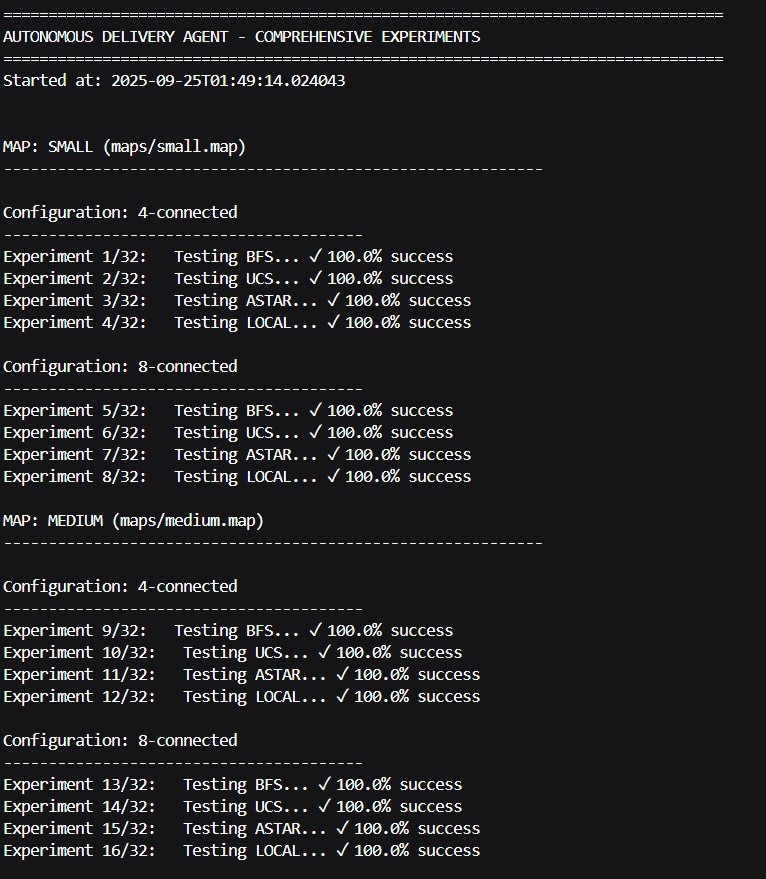
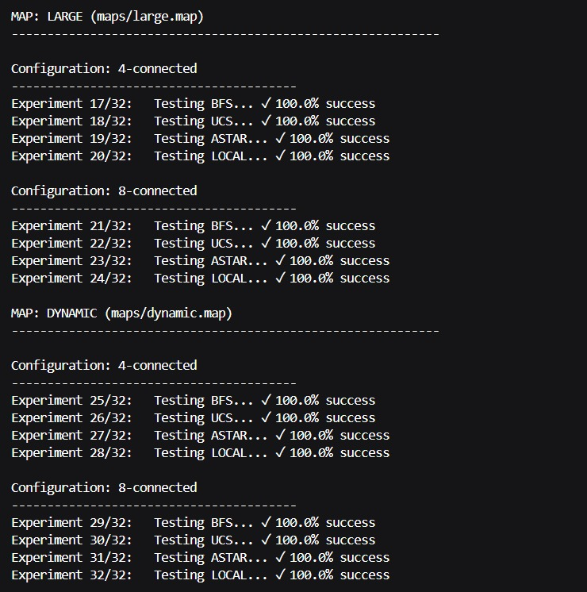

# Autonomous Delivery Agent

An intelligent agent that navigates a 2D grid city to deliver packages using various path planning algorithms as part of CSA2001 - Fundamentals of AI and ML Project Based Learning.


## 📋 Project Overview

This project implements an autonomous delivery agent that can navigate through a 2D grid environment with:
- **Static obstacles** (buildings, barriers)
- **Varying terrain costs** (roads, grass, mud with different movement costs)
- **Dynamic moving obstacles** (other vehicles, pedestrians)
- **Multiple path planning algorithms** for optimal delivery efficiency

## 🚀 Quick Start

### Prerequisites
- Python 3.8 or higher
- pip (Python package manager)

### 💻 Installation
```bash
# Clone the repository
git clone <repository-url>
cd autonomous_delivery_agent

# Install dependencies
pip install -r requirements.txt

# Verify installation
python -m unittest discover tests/
```
### Run Basic Example
```bash
# Run A* algorithm on small map
python src/cli.py maps/small.map --planner astar --visualize

# Run comprehensive experiments
python run_experiments.py
```

## 📁 Project Structure
``` text 
autonomous_delivery_agent/
├── src/ # Source code
│ ├── environment.py # Grid environment implementation
│ ├── agent.py # Delivery agent logic
│ ├── planners/ # Path planning algorithms
│ │ ├── uninformed.py # BFS, Uniform Cost Search
│ │ ├── informed.py # A* Search
│ │ └── local_search.py # Local search algorithms
│ ├── utils.py # Utility functions
│ └── cli.py # Command line interface
├── maps/ # Map configurations
│ ├── small.map # 10x10 grid
│ ├── medium.map # 20x20 grid
│ ├── large.map # 30x30 grid
│ └── dynamic.map # Map with dynamic obstacles
├── tests/ # Unit tests
│ ├── test_environment.py
│ ├── test_planners.py
│ └── test_agent.py
├── requirements.txt # Python dependencies
├── requirements.md # Setup instructions
├── run_experiments.py # Experiment runner
└── README.md # This file
```
 ### 🧠 Algorithms Implemented

**1. Breadth-First Search (BFS)** 
   
- Type: Uninformed search
- Optimality: Guarantees shortest path length
- Use Case: When path length matters more than cost
- Complexity: O(b^d) where b is branching factor, d is depth

**2. Uniform-Cost Search (UCS)**
   
- Type: Uninformed search
- Optimality: Guarantees lowest cost path
- Use Case: When terrain costs vary significantly
- Complexity: O(b^(1+C/ε)) where C is optimal cost

**3. A * Search**
   
- Type: Informed search with heuristics
- Optimality: Guarantees optimal path with admissible heuristic
- Use Case: General purpose optimal path finding
- Complexity: O(b^d) with good heuristic

**4. Local Search (Hill-climbing with Random Restarts)** 
   
- Type: Optimization with random restarts
- Optimality: May find suboptimal solutions
- Use Case: Dynamic environments requiring quick replanning
- Complexity: Depends on number of restarts

## Features

### Path Planning Algorithms
- **Breadth-First Search (BFS)**: Uninformed search guaranteeing shortest path length
- **Uniform-Cost Search (UCS)**: Uninformed search guaranteeing optimal cost path
- **A * Search**: Informed search with admissible heuristics for optimal efficiency
- **Local Search**: Hill-climbing with random restarts for dynamic replanning

### Environment Features
- **4-connected movement** (up, down, left, right)
- **Configurable terrain costs** (integer values ≥ 1)
- **Static obstacles** (impassable cells)
- **Dynamic obstacles** with predictable movement patterns
- **Real-time replanning** capability

 ### 🗺️ Map File Format
 ``` text
width height
S start_x start_y
G goal_x goal_y
T terrain_x terrain_y cost
O obstacle_x obstacle_y
D dynamic_x dynamic_y schedule

```
### 📊 Experimental Results

``` bash
python run_experiments.py
```
This generates:

- experiment_results.json: Detailed metrics in JSON format

- experiment_summary.txt: Human-readable summary with rankings

## Performance Metrics

- Success Rate: Percentage of successful path findings
- Planning Time: Average time taken to find path (seconds)
- Path Cost: Total movement cost of delivered path
- Nodes Expanded: Search space exploration efficiency
- Path Length: Number of steps in the path

## 🧪 Testing
``` bash 
python -m unittest discover tests/  
```

### Individual Test Files
``` bash
python -m unittest tests/test_environment.py
python -m unittest tests/test_planners.py  
python -m unittest tests/test_agent.py
```

### Test Coverage

The test suite covers:

* ✅ Environment initialization and configuration

* ✅ Path planning algorithm correctness

* ✅ Agent movement and replanning logic

* ✅ Obstacle avoidance and terrain cost handling

## Results and Analysis

* The project includes comprehensive experimental analysis comparing:

1) Path cost: Total movement cost of delivered path
2) Nodes expanded: Search space exploration efficiency
3) Planning time: Algorithm computational performance
4) Success rate: Reliability in finding valid paths

**Results are automatically generated in experiment_results.txt when running run_experiments.py.**

## Screenshots 

**A * in Dynamic Map**



**BFS in Dynamic Map**



**UCS in Dynamic Map**



**LOCAL in Dynamic Map**



**All Experiments**


<br>


## Report

**Download this file**
<a href ="report/Report_Autonomous_Delivery_Agent.pdf"> Report </a>

## Dynamic Replanning

* The agent supports dynamic replanning when:

1) New obstacles appear during execution
2) Terrain costs change unexpectedly
3) The original path becomes blocked

**Example dynamic scenario provided in maps/dynamic.map.**

## Git Workflow

1) Create feature branch: git checkout -b feature-name
2) Make changes and test thoroughly
3) Commit with descriptive messages
4) Push and create pull request

## License

This project is part of CSA2001 - Fundamentals of AI and ML course requirements. Academic integrity policies apply.

## Acknowledgments

- Course instructors for project guidelines
- AI search algorithm literature for reference implementations
- Python community for excellent development tools

<div align="center">
Built with ❤️ for AI/ML Education

*CSA2001 - Fundamentals of AI and ML Project*

</div> 


